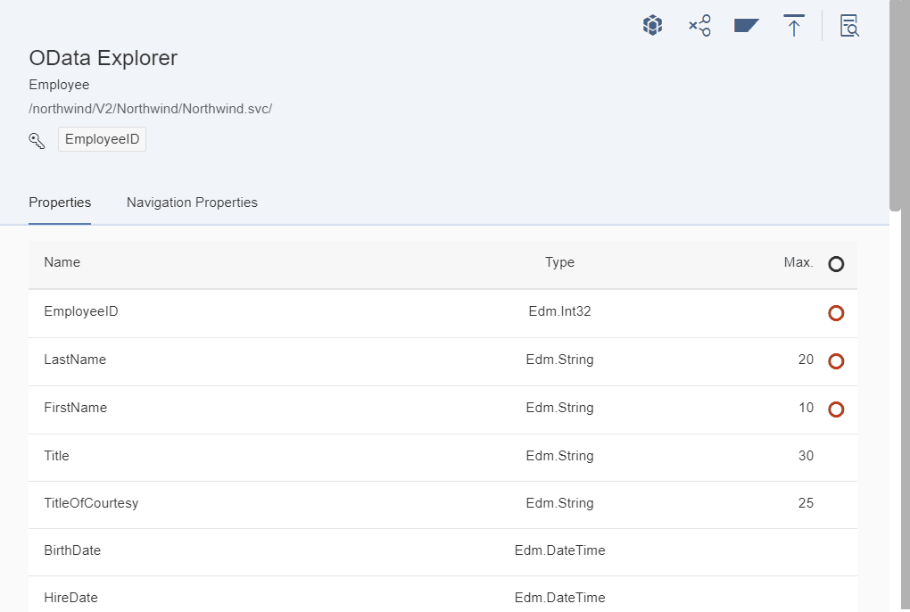

# ODataExplorer

## [OpenUI5 Developer Blog](http://openui5.blogspot.com/2017/12/odata-explorer.html)

> [UI5](http://openui5.org/) tool to explore entities of a given OData v2 service.

### [Online Demo (SAP HCP)](https://odataexplorer-p1940953245trial.dispatcher.hanatrial.ondemand.com/index.html)

### Highlights

> - app to explorer a given [OData v2](http://www.odata.org/documentation/odata-version-2-0/) service
> - demo HCP destination pointing out to northwind example service [Northwind](http://services.odata.org/V2/Northwind/Northwind.svc/) 
> - included coding to add service browser for SAP Gateways using /sap/opu/odata/iwfnd/catalogservice/
> - some css fixes for token (avoid clipping in Tablet, float) 
> - added Visualizer to render networkgraph with options to export to SVG and PNG 

## SAP Service Browser

If you will use the app to explorer services on an SAP Gateway, you can enable the service catalog to discover and search for all existing services.
The selected service will be loaded automatically. To enable this feature you have to
> - inside the manifest.json copy the xmodel/catalog model to the existing model section and delete xmodel (preload: false currently does not work, maybe a bug)  
> - inside the Metadata.controller.js set property "_bUseCatalogService: true" to true to show service selector instead of using demo service
> - FIX: I also changed useBatch: false like mentioned by Gregor's issue [#1](https://github.com/hschaefer123/odataexplorer/issues/1)

## License

Released under the [Apache license](http://www.apache.org/licenses/). Have at it.